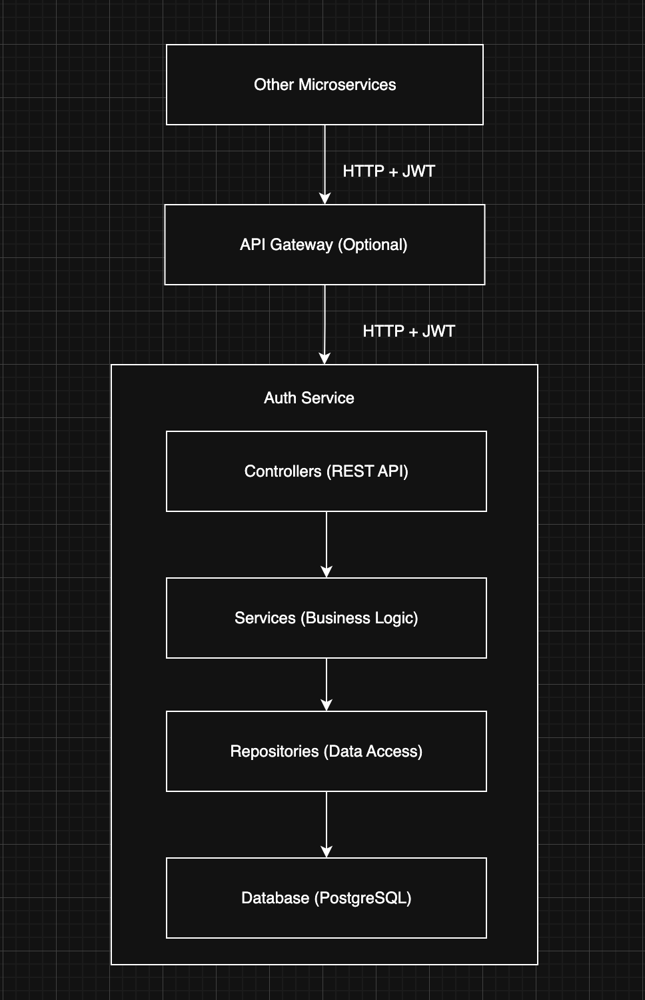

# Auth Service - Microservice Authentication System

A production-grade, scalable authentication service built with Spring Boot 4, designed for microservices architecture. This service provides JWT-based authentication, authorization, and user management capabilities.

## Features
✔ JWT-based authentication (Access & Refresh tokens)

✔ Role-based authorization (USER, ADMIN, SUPER_ADMIN)

✔ Email verification for new registrations

✔ Password reset functionality

✔ Account locking after failed attempts

✔ Refresh token rotation for enhanced security

✔ CORS configuration ready

✔ Docker containerization

✔ Health checks & Metrics (Prometheus, Actuator)

✔ API Documentation (Swagger/OpenAPI)

✔ Microservice ready (Service Discovery support)

✔ Database persistence with PostgreSQL

✔ Comprehensive error handling

✔ Input validation

✔ Logging and monitoring

✔ Resilience patterns (Circuit Breaker, Retry)

## Prerequisites
- Java 21 or higher

- Docker & Docker Compose

- PostgreSQL 15+

- Gradle 7.6+

- Redis (optional, for rate limiting)

## Tech Stack
- Spring Boot 4 (Spring Framework 6)

- Spring Security 6

- Spring Data JPA

- PostgreSQL

- JWT (jjwt)

- Lombok

- Docker

- Prometheus & Grafana (monitoring)

- Spring Cloud (microservices)

- Swagger/OpenAPI 3 (API documentation)

## Architecture


## Project Structure
```
auth-service/
├── src/main/java/com/imran/authservice/
│   ├── AuthServiceApplication.java          # Main application class
│   ├── config/                              # Configuration classes
│   │   ├── SecurityConfig.java              # Security configuration
│   │   ├── JwtConfig.java                   # JWT properties
│   │   └── WebClientConfig.java             # WebClient for service calls
│   ├── controller/                          # REST controllers
│   │   ├── AuthController.java              # Auth endpoints
│   ├── dto/                                 # Data Transfer Objects
│   │   ├── AuthRequest.java                 # Login request
│   │   ├── AuthResponse.java                # Auth response
│   │   ├── RegisterRequest.java             # Registration request
│   │   └── UserDTO.java                     # User DTO
│   ├── exception/                           # Custom exceptions
│   │   ├── GlobalExceptionHandler.java      # Exception handler
│   │   ├── ResourceNotFoundException.java
│   │   └── InvalidTokenException.java
│   ├── model/                               # Entity classes
│   │   ├── User.java                        # User entity
│   │   └── RefreshToken.java                # Refresh token entity
│   ├── repository/                          # Data repositories
│   │   ├── UserRepository.java
│   │   └── RefreshTokenRepository.java
│   ├── security/                            # Security components
│   │   ├── JwtTokenProvider.java            # JWT utilities
│   │   ├── JwtAuthenticationFilter.java     # JWT filter
│   │   ├── CustomUserDetailsService.java    # User details service
│   │   └── JwtAuthenticationEntryPoint.java
│   ├── service/                             # Business logic
│   │   ├── AuthService.java                 # Auth business logic
│   │   └── EmailService.java                # Email service interface
│   └── util/                                # Utility classes
├── src/main/resources/
│   ├── application.yml                      # Main config
│   ├── application-dev.yml                  # Dev config
│   └── application-prod.yml                 # Prod config
├── docker-compose.yml                       # Docker compose setup
├── Dockerfile                               # Docker configuration
├── gradlew                                  # Gradle wrapper
├── build.gradle                             # Build configuration
└── README.md                                # This file
```

## Quick Start

### 1. Clone the Repository
```aiignore
git clone https://github.com/mihabgit/auth-service.git
cd auth-service
```

### 2. Configure Environment Variables

Create a .env file:

```aiignore
# Database
DB_URL=jdbc:postgresql://localhost:5432/authdb
DB_USERNAME=postgres
DB_PASSWORD=postgres

# JWT
JWT_SECRET=your-256-bit-secret-key-must-be-at-least-32-chars-long

# Email (for email verification)
MAIL_USERNAME=your-email@gmail.com
MAIL_PASSWORD=your-app-password

# Service Discovery
EUREKA_URL=http://localhost:8761/eureka

# Profile
PROFILE=dev
```

### 3. Run with Docker Compose (Recommended)
```aiignore
# Start all services
docker-compose up -d

# View logs
docker-compose logs -f auth-service

# Stop services
docker-compose down
```

### 4. Run Locally (Development)
```aiignore
# Build the project
./gradlew clean build

# Run the application
./gradlew bootRun

# Or run with profile
SPRING_PROFILES_ACTIVE=dev ./gradlew bootRun
```

## Configuration
### Application Properties
Key configuration options in application.yml:
```aiignore
spring:
  application:
    name: auth-service

  profiles:
    active: ${PROFILE:dev}

  datasource:
    url: jdbc:postgresql://localhost:5432/authdb
    username: ${DB_USERNAME:postgres}
    password: ${DB_PASSWORD:postgres}
    hikari:
      maximum-pool-size: 10
      minimum-idle: 5
      connection-timeout: 30000

  jpa:
    hibernate:
      ddl-auto: update
    properties:
      hibernate:
        dialect: org.hibernate.dialect.PostgreSQLDialect
        jdbc.batch_size: 20
        order_inserts: true
        order_updates: true
    show_sql: false

server:
  port: ${PORT:20001}
  servlet:
    context-path: /auth-service

jwt:
  secret: 295a48c13ac272c6d76a3c4fc6b4069c09e6ab67d3857cf3d771c88bcdcaa4741353a92e093e1470347deb78999847cee65e83cf27fecdf64e7c474ce8ac1fa8
  access-token-expiration: 900000
  refresh-token-expiration: 604800000
  issuer: auth-service

```

## API Endpoints

### Authentication Endpoints

| Method | Endpoint                              | Description              | Access         |
|--------|---------------------------------------|--------------------------|----------------|
| POST   | `/api/v1/auth/register`               | Register new user        | Public         |
| POST   | `/api/v1/auth/login`                  | Login user               | Public         |
| POST   | `/api/v1/auth/refresh-token`          | Refresh access token     | Public         |
| POST   | `/api/v1/auth/logout`                 | Logout user              | Authenticated  |
| GET    | `/api/v1/auth/verify-email/{token}`   | Verify email             | Public         |
| POST   | `/api/v1/auth/reset-password`         | Request password reset  | Public         |
| POST   | `/api/v1/auth/change-password`        | Change password          | Authenticated  |
| GET    | `/api/v1/auth/me`                     | Get current user         | Authenticated  |

### Monitoring Endpoints

| Method | Endpoint                   | Description              |
|--------|----------------------------|--------------------------|
| GET    | `/actuator/health`         | Health check             |
| GET    | `/actuator/metrics`        | Application metrics      |
| GET    | `/actuator/prometheus`     | Prometheus metrics       |

### API Documentation

- Swagger UI: ```http://localhost:8080/auth-service/swagger-ui.html```

- OpenAPI: ```http://localhost:8080/auth-service/v3/api-docs```

## Authentication Flow
### 1. User Registration
```
1. POST /api/v1/auth/register
2. Save user with PENDING status
3. Send verification email
4. User verifies email (click link)
5. Account activated (ACTIVE status)
```

### 2. User Login
```aiignore
1. POST /api/v1/auth/login
2. Validate credentials
3. Check account status and lock status
4. Generate JWT access token
5. Generate refresh token
6. Return tokens in response
```

### 3. Token Refresh
```aiignore
1. POST /api/v1/auth/refresh-token
2. Validate refresh token
3. Revoke old refresh token
4. Generate new access token
5. Generate new refresh token
6. Return new tokens
```

### 4. Protected Resource Access
```aiignore
1. Request with Authorization: Bearer <token>
2. JwtAuthenticationFilter validates token
3. Set Authentication in SecurityContext
4. Access granted/denied based on roles
```

## API Testing with cURL
```aiignore
# 1. Register new user
curl -X POST http://localhost:8080/auth-service/api/v1/auth/register \
  -H "Content-Type: application/json" \
  -d '{
    "email": "user@example.com",
    "username": "newuser",
    "password": "Password123!",
    "firstName": "John",
    "lastName": "Doe"
  }'

# 2. Login
curl -X POST http://localhost:8080/auth-service/api/v1/auth/login \
  -H "Content-Type: application/json" \
  -d '{
    "email": "user@example.com",
    "password": "Password123!"
  }'

# 3. Access protected endpoint
curl -X GET http://localhost:8080/auth-service/api/v1/auth/me \
  -H "Authorization: Bearer <access-token>"
```

### Login Response
```aiignore
{
    "accessToken": "eyJhbGciOiJIUzI1NiJ9.eyJzdWIiOiJmZTMyOGJkMS03NWRjL...",
    "refreshToken": "eyJhbGciOiJIUzI1NiJ9.eyJzdWIiOiJmZTMyOGJkMS03NWRjL...",
    "tokenType": "Bearer",
    "expiresIn": 900000,
    "user": {
        "id": "fe328bd1-75dc-4f87-b6a5-206cd89f246f",
        "email": "imranmihab@gmail.com",
        "username": "imran",
        "firstName": "Imran",
        "lastName": "Hossain",
        "status": "ACTIVE",
        "role": "USER",
        "lastLogin": "2025-12-25T20:48:27.757886",
        "mfaEnabled": false,
        "createdAt": "2025-12-24T01:24:58.093345"
    }
}
```

### Error Response
```aiignore
{
  "timestamp": "2024-01-15T10:30:00",
  "status": 401,
  "error": "Unauthorized",
  "message": "Invalid credentials",
  "path": "/api/v1/auth/login"
}
```

### Contributing
```aiignore
Fork the repository
Create a feature branch
Commit your changes
Push to the branch
Create a Pull Request
```

### Support
For support, email [imranhmihab@gmail] or create an issue in the GitHub repository.

Built with ❤️ using Spring Boot & Microservices Architecture.